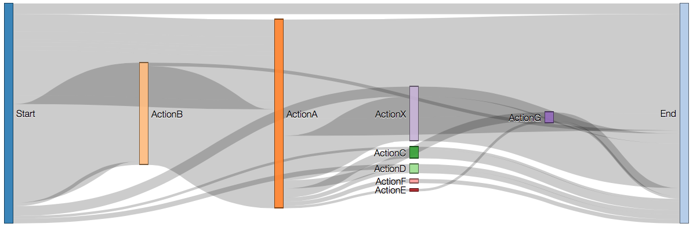

(Chart generated from the [sample file](sample.csv).)

This app is automagically deployed at http://anarseyf.github.io/sankey/.

To check out the code, do this in the terminal on Mac or Linux (not sure how to do this on Windows):

```
# mkdir ~/git && cd ~/git
# git clone https://github.com/anarseyf/sankey.git
# cd sankey
# open index.html
```

A few notes:

* Empty lines (like the 2nd line in your sample file) is interpreted as "no action was taken on those 13 messages", so they go directly from **Start** to **End**.
* Each entry in the CSV file results in its own line. Depending on the data, there can be multiple lines going from **A** to **B** in parallel. As a concrete example: in the sample file, there are multiple entries starting with **MarkAsRead**, with the implied link **Start** -> **MarkAsRead**. It's possible to consolidate those into one line -- let me know if that would be valuable.
* Cycles are handled too (for example, if both **MarkAsRead,Flag** and **Flag,MarkAsRead** entries are present), but rendering of lines isn't perfect.
* Actual values for each line can be seen on mouse-over.

Browser support and Limitations:

* Works on **Firefox**, **Safari**, and **Chrome**. Not tested in **Edge** or **Internet Explorer**. 
* It's best to use **Firefox**. The file uploader accepts files from anywhere, not just from subfolders of the repository. The file uploader on **Safari** only accepts files located in the same directory as the *index.html* file (no subfolders).
* On **Chrome**, simply opening the *index.html* file does not work (due to cross-origin complaints), but there's an easy workaround:
  * In the terminal:
  ```
  # cd ~/git/sankey
  # python -m SimpleHTTPServer
  ```
  * In the browser, open **http://localhost:8000**

(Adapted from http://bost.ocks.org/mike/sankey/ and http://bl.ocks.org/cfergus/3921009)
